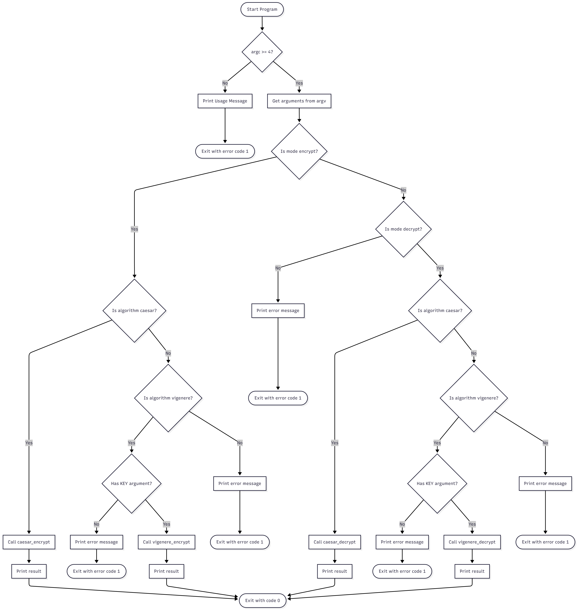

# Cryptography
This repository contains my (s244871) code for the (62712) Cryptography program.  
The program implements Caesar and Vigenère ciphers with encryption and decryption capabilities.  
Below is the flowchart showing the program's process:

## Files
- [src/main.c](src/main.c) – main program with CLI
- [src/caesar.c](src/caesar.c) – Caesar cipher implementation
- [src/vigenere.c](src/vigenere.c) – Vigenère cipher implementation
- [include/caesar.h](include/caesar.h) – Caesar cipher header file
- [include/vigenere.h](include/vigenere.h) – Vigenère cipher header file
- [crypto_flowchart.png](crypto_flowchart.png) – flowchart of the program
